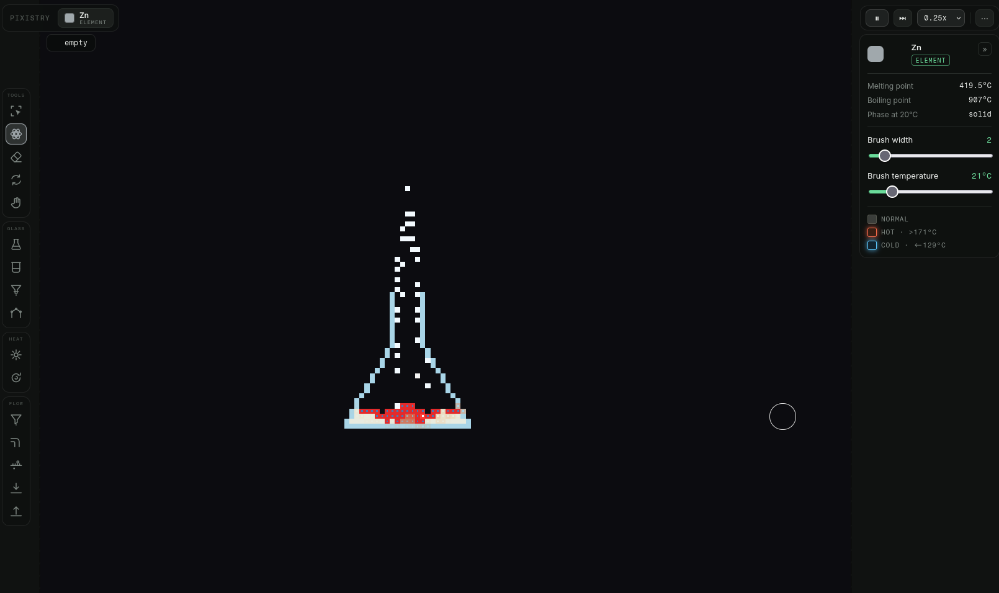

# Pixistry

A 2D falling-sand-style chemistry sandbox: a lab-bench sim where reactions come from a small
hand-authored `reactants -> products` table checked against neighboring cells each tick.

**Live demo:** https://meyhem.github.io/pixistry/

See [ARCHITECTURE.md](ARCHITECTURE.md) for the per-layer breakdown and `CLAUDE.md` for
development commands and conventions.
